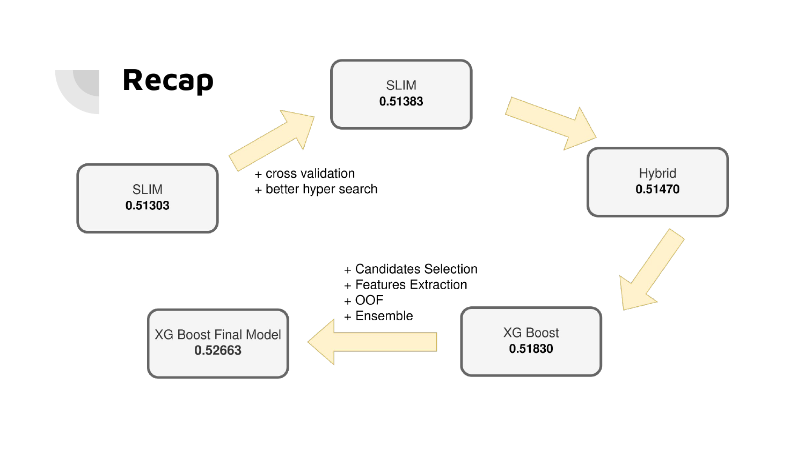
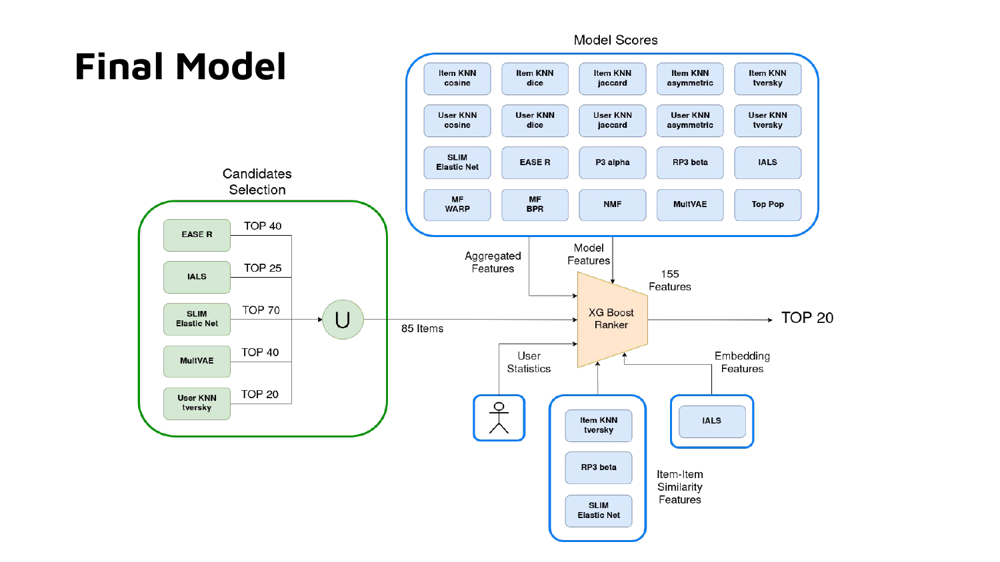

# RecSys Challenge 2025/2026 — Politecnico di Milano

My solution for the Recommender Systems 2025/2026 Challenge, the course competition of the
Recommender Systems course at Politecnico di Milano.

This repository is built on the course framework
[remaplab/RecSys_Course_AT_PoliMi](https://github.com/remaplab/RecSys_Course_AT_PoliMi):
the recommender implementations, evaluation and tuning infrastructure come from there.
My own work is in [`Challenge/`](Challenge/) — see [Credits and license](#credits-and-license).

**Final result: 6th place out of 78 teams** — private leaderboard `0.52663`, public `0.52806`,
as a solo entry in 20 submissions.

The task is top-20 item recommendation from an implicit-feedback user-rating matrix,
evaluated with **Recall@20**. The final system is a two-stage retrieve-and-rank pipeline:
a greedy, utility-driven candidate generator feeding an XGBoost ranker over 155 features.

The competition ran on a private Kaggle page and the dataset is not public, so neither is
linked from this repository.

📄 **[Full presentation (22 slides)](docs/presentation.pdf)**

---

## Dataset

| | |
|---|---|
| Interactions | 3,043,058 |
| Users | 27,095 |
| Items | 6,969 |
| Sparsity | 98.39% |
| Mean interactions per item | ~437 |

Pure collaborative filtering: implicit ratings only, no content features. Item popularity
follows the usual long tail.

---

## Results

Progression across the competition, private leaderboard (Recall@20):

| Stage | Private | Public |
|---|---|---|
| SLIM ElasticNet, holdout split + Optuna | 0.51303 | 0.51462 |
| SLIM ElasticNet, 5-fold CV + two-stage search | 0.51383 | 0.51514 |
| Hybrid (SLIM + IALS + ItemKNN score blending) | 0.51470 | 0.51524 |
| XGBoost, first attempt (SLIM candidates, basic features) | 0.51830 | 0.51974 |
| **XGBoost final** (greedy candidates + 155 features + OOF + ensemble) | **0.52663** | **0.52806** |



### Single-model comparison

Mean Recall@20 under 5-fold cross-validation, before any hybridization or reranking:

| Model | Recall@20 |
|---|---|
| SLIM ElasticNet | 0.289 |
| EASE-R | 0.282 |
| ItemKNN (tversky) | 0.250 |
| RP3beta | 0.248 |
| IALS | 0.247 |
| MultVAE | 0.245 |
| ... | ... |
| TopPop (baseline) | 0.107 |

SLIM ElasticNet was the strongest individual model by a clear margin. The strong showing of
the asymmetric similarities (tversky on both ItemKNN and UserKNN) suggests genuinely
asymmetric structure in the data.

Tuned hyperparameters and per-model scores for all 20+ models are in
[`models_performance.json`](models_performance.json) and [`performance_logs/`](performance_logs/).

---

## Method

### Two-stage architecture



### 1. Candidate selection by greedy marginal utility

The standard approach is to pick arbitrary cutoffs for a handful of models and union them.
That creates massive redundancy and floods the ranker with noise — every model contributes
its own top-k, mostly overlapping, and the ranker pays for all of it.

Instead, candidate generation is treated as an explicit optimization: iteratively add the
batch of candidates giving the most new correct hits for the fewest new items. For a model
*m* at cutoff *c*, given the already-selected set *S*, define

```
                  |R(m,c) \ S  ∩  GT|          new correct hits
marginal utility = ────────────────────  =  ─────────────────────
                     |R(m,c) \ S|              new items added
```

where `R(m,c)` are the items proposed by model *m* at cutoff *c* and `GT` is the validation
ground truth.

The loop starts from an empty candidate set with every model's cutoff at zero. At each step
it evaluates the next three discretized cutoffs for every model, scores each (model, cutoff)
pair by marginal utility averaged over 5 folds, commits the best one, and repeats until the
average candidate count per user hits a threshold.

Run unrestricted, the algorithm recruits nearly every model. Deeper analysis showed this is
partly an artifact of greedy ordering — models chosen early for high marginal utility
generate hits that later, higher-cutoff models would have found anyway. Comparing several
configurations, the one used in the final model restricts generation to five models:

| Model | Cutoff |
|---|---|
| SLIM ElasticNet | 70 |
| EASE-R | 40 |
| MultVAE | 40 |
| IALS | 25 |
| UserKNN (tversky) | 20 |

Union: **~85 candidates per user**, down from ~150 in the unrestricted run at comparable recall.

### 2. Feature extraction — 155 features

| Family | Contents |
|---|---|
| Candidate-generation flags | `top_10` … `top_50` — which cutoff band first produced this candidate |
| Model features | Score, RankPosition, Recommended, per generating model |
| Item-item similarity | Max / mean / std similarity to the user's profile via SLIM, RP3beta, ItemKNN |
| Embedding features | User clustering, item clustering, PCA components |
| Aggregate features | Max, min, mean, std across the per-model score and rank columns |
| User statistics | User profile length, item popularity, ratios |

Implemented in [`Challenge/features_engineering.py`](Challenge/features_engineering.py).

Notably, the candidate-generation flags dominate the ranker's gain-based feature importance
— `top_20` scores roughly 4.5× the next feature — which says the candidate-selection stage,
not the ranker, was where most of the improvement came from.

### 3. Ranking

- **Out-of-fold training data.** Candidate generation and feature extraction are run
  separately on each of 10 folds and concatenated, so the ranker never trains on features
  computed from the same interactions it is scored against. Final training frame:
  ~22.8M rows × 155 features.
- **Ensemble of 5 XGBoost rankers** (`rank:ndcg`), differing by random seed and slightly
  varied `n_estimators`, averaged at prediction time.

---

## Repository layout

```
Challenge/                  ← my work
├── features_engineering.py     candidate generation + all 155 features
├── hyper_tuning.py             Optuna objective wrappers
├── XGBoostReranker.py          ranker wrapper
├── XGBoostNative.py            native-API variant
├── paths.py                    environment-aware paths (local / Colab / Kaggle)
├── final_pipeline/             the pipeline behind the 0.52663 submission
│   ├── candidate_selection.ipynb   greedy marginal-utility search
│   ├── dataframe_creation.ipynb    OOF feature frames
│   └── blind_prediction.ipynb      final training + submission
├── tuning/                     per-model Optuna studies
├── models_training/            individual model training
├── cross_validation/           5-fold CV setup
├── hybrid/                     score blending, similarity merging
└── xg_boost/                   earlier XGBoost iterations

Recommenders/  Evaluation/  Data_manager/       ← course framework (see Credits)
HyperparameterTuning/  CythonCompiler/  Utils/
Notebooks_utils/
```

Notebooks keep their output cells — the plots are the record of what each experiment
actually produced.

---

## Running it

### 1. Environment

Python 3.13 — the committed Cython extensions are built against `cpython-313`.

```bash
python -m venv .venv && source .venv/bin/activate
pip install -r requirements.txt
python run_compile_all_cython.py     # builds the Cython recommenders
```

### 2. Set your storage root

**This is the one thing you must edit before anything will run.**

All paths derive from a single `PERSISTENT_STORAGE` root defined in
[`Challenge/paths.py`](Challenge/paths.py). The file picks it by sniffing the working
directory, so the same notebooks run unchanged in three places:

| Environment | Detected by | Storage root |
|---|---|---|
| Kaggle | `/kaggle` in cwd | `/kaggle/working` |
| Colab | `/content` in cwd | `/content/drive/MyDrive/RecSys` (mounted Drive) |
| Local | otherwise | hardcoded — **change this to your own path** |

Line 15 of `Challenge/paths.py` is my machine's path:

```python
else:
    ENV = "local"
    PERSISTENT_STORAGE = "/home/luigi/RecSys"   # <- point this at your own directory
```

Everything else is derived from it and created automatically on import — `data/`,
`models/`, `submissions/`, `performance_logs/`, `xg_boost_data/{splits,models,dataframes}`,
and the Optuna SQLite store. Note that the storage root is **outside** the repo: model
artifacts and intermediate dataframes are large and deliberately not tracked here.

### 3. Data

The challenge dataset is private to the course competition and is not redistributed here.
Two files are expected in `<PERSISTENT_STORAGE>/data/`:

| File | Columns |
|---|---|
| `data_train.csv` | `row,col` — one row per interaction, renamed to `UserID,ItemID` in preprocessing |
| `data_target_users_test.csv` | `user_id` — the users to generate recommendations for |

Interactions are purely implicit: `Challenge/preprocessing.ipynb` builds the URM with a
value of 1 per interaction, so no rating column is read. Any implicit-feedback dataset in
that shape will run through the pipeline.

When running on Kaggle, `paths.py` instead resolves these to the mounted competition
inputs, so no manual placement is needed there.

### 4. The notebook setup cell

Every notebook opens with a setup cell that makes it runnable in all three environments: on
Colab it mounts Drive and clones this repo with a token from `getpass`, on Kaggle it reads
the token from `kaggle_secrets`, and locally it expects the repo to already exist. That
cell contains a second hardcoded path:

```python
LOCAL_REPO_PATH = "/home/luigi/RecSys" if IS_LOCAL else os.path.join(WORKING_DIR, REPO_NAME)
```

Running locally, either clone the repo to that location or edit the string. It appears in
61 of the notebooks — the simplest fix is a search-and-replace across `Challenge/`.

### 5. Order of execution

To reproduce the final submission, work through `Challenge/final_pipeline/`:

1. **`candidate_selection.ipynb`** — runs the greedy marginal-utility search and produces
   the model/cutoff configuration
2. **`prediction_dataframe.ipynb`** — builds the 10 out-of-fold feature frames, writing
   `xg_boost_data/dataframes/OOF_folds/prediction_train_OOF_fold{0..9}.parquet`
3. **`blind_prediction.ipynb`** — loads those folds, trains the 5-seed XGBoost ensemble and
   writes the submission

`dataframe_creation.ipynb` and `prediction.ipynb` are earlier iterations of steps 2 and 3
and are kept for the record; the rest of `final_pipeline/` (`baseline`, `check_features`,
`optimize`, `fast_subsampled_tuning*`) are experiments feeding into those.

`Challenge/tuning/` (per-model Optuna studies) only needs re-running to re-derive the base
recommender hyperparameters; the tuned values are already committed in
[`models_performance.json`](models_performance.json) and [`performance_logs/`](performance_logs/).

---

## Credits and license

`Recommenders/`, `Evaluation/`, `Data_manager/`, `HyperparameterTuning/`, `CythonCompiler/`,
`Utils/` and `Notebooks_utils/` come from the course repository
[RecSys_Course_AT_PoliMi](https://github.com/remaplab/RecSys_Course_AT_PoliMi) by Maurizio
Ferrari Dacrema and colleagues, and are the work of their original authors. Everything in
`Challenge/` is mine.

This repository is released under **AGPL-3.0**, inherited from the course framework.
See [LICENSE](LICENSE).
